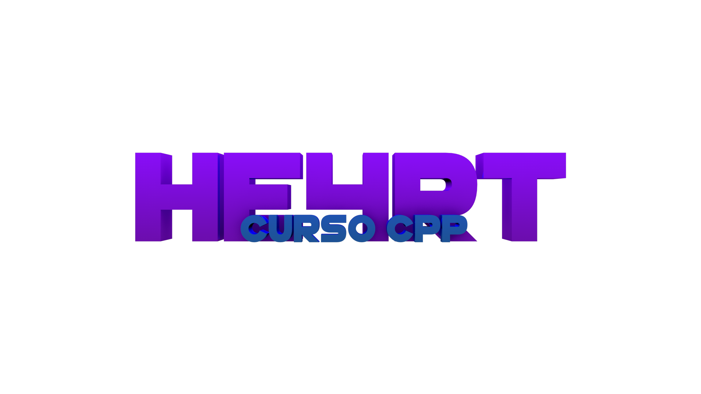

<!-- PROJECT LOGO -->
 

  

  <h3 align="center">He4rt Developers CPP Course</h3>

  

    Nesse curso, você irá aprender toda a base do C++!
     
    <a href="#"><strong>Explore the docs »</strong></a>
     
     
    <a href="discord.io/He4rt">Report a Error</a>
    
  

  * [Bem-Vindo ao Curso]()
  * [Ambiente de Programação]()
  * [Hello World]()
  * [Comentários]()
  * [Variáveis]()
  * [Operadores]()
  * [Loop]()
  * [Vetores]()
  * [Array e Vector]()
  * [Funções]()
  * [Static]()
  * [Lambdas]()
  * [Header]()
  * [Namespace]()
  * [Ponteiros]()
  * [Referências]()
  * [Stack e Heap]()
  * [Templates]()
  * [Keyword auto]()
  * [Sorting]()
  * [Big O Notation]()
  * [Header algorithm]()
  * [Structs]()
  * [Orientação a Objetos]()
  * [Programação Funcional]()
  * [CPP Moderno]()
  * [Value Categories]()
  * [Constexpr]()
  * [Fold Expressions com templates]()
  * [Standard library]()
  * [Undefined Behavior]()
  * [RAII]()
  * [Regex]()
  * [Move Semantics]()
  * [Threading]()
  * [Opcional Gerador de Projetos com CMake e MinGW]()
  * [Opcional Interface Gráfica]()

<!-- CONTACT -->
## Contact

He4rt Developers - [@He4rtDevs](https://twitter.com/He4rtDevs)

