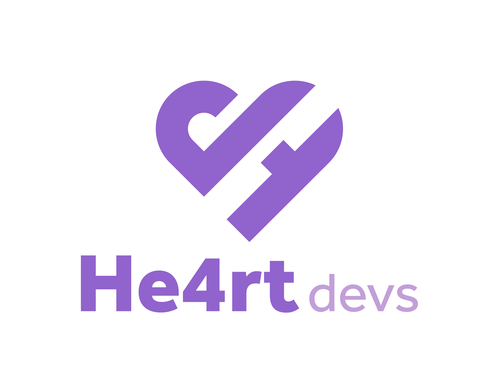

<!-- PROJECT LOGO -->
<br />
<p align="center">
  <a href="https://github.com/Novout/He4rt-CPP-Tutorial">
    
  </a>

  <h3 align="center">Tutorial de C++ da He4rt Developers</h3>

  <p align="center">
    <br />
    <a href="https://novout.github.io/cpp4noobs/"><strong>Explore a documentação »</strong></a>
    <br />
    <br />
    <a href="https://github.com/Novout/He4rt-CPP-Tutorial/issues">Report Bug</a>
    ·
    <a href="https://github.com/Novout/He4rt-CPP-Tutorial/issues">Request Feature</a>
  </p>
</p>

<!-- TABLE OF CONTENTS -->

## Table of Contents

- [Sobre o Projeto](#sobre-o-projeto)
  - [Desenvolvido Com](#desenvolvido-com)
- [Iniciando](#iniciando)
  - [Pré-requisitos](#pré-requisitos)
  - [Instalação](#instalação)
- [Como Usar](#como-usar)
- [Contribuidores](#contribuidores)
- [Como Contribuir](#como-contribuir)
- [Licença](#licença)
- [Contato](#contato)

<!-- ABOUT THE PROJECT -->

## Sobre o Projeto

Produzido com a colaboração de integrantes da **He4rt Developers**, esse tutorial tem como objetivo principal apresentar e ensinar a linguagem de programação C++ de uma maneira fácil, descomplicada e acessível para todos.

### Desenvolvido Com

- [NodeJS](https://nodejs.org)
- [VuePress](https://vuepress.vuejs.org/)

<!-- GETTING STARTED -->

## Iniciando

Para fazer uma cópia e rodar o projeto localmente, siga estes passos.

### Pré-requisitos

Os programas a seguir são necessários para estender, modificar e utilizar o projeto.

- [NodeJS](https://nodejs.org)
- [Yarn](https://yarnpkg.com)

### Instalação

1. Clone o repositorio

```sh
git clone https://github.com/Novout/He4rt-CPP-Tutorial.git
```

2. Instale as dependências

```sh
yarn install
```

<!-- USAGE EXAMPLES -->

## Como Usar

Para iniciar o servidor de desenvolvimento utilize o seguinte comando

```sh
yarn dev
```

Para realizar a build do projeto execute o seguinte comando

```sh
yarn build
```

## Contribuidores

[](https://sourcerer.io/fame/Novout/Novout/He4rt-CPP-Tutorial/links/0)[](https://sourcerer.io/fame/Novout/Novout/He4rt-CPP-Tutorial/links/1)[](https://sourcerer.io/fame/Novout/Novout/He4rt-CPP-Tutorial/links/2)[](https://sourcerer.io/fame/Novout/Novout/He4rt-CPP-Tutorial/links/3)[](https://sourcerer.io/fame/Novout/Novout/He4rt-CPP-Tutorial/links/4)[](https://sourcerer.io/fame/Novout/Novout/He4rt-CPP-Tutorial/links/5)[](https://sourcerer.io/fame/Novout/Novout/He4rt-CPP-Tutorial/links/6)[](https://sourcerer.io/fame/Novout/Novout/He4rt-CPP-Tutorial/links/7)

<!-- CONTRIBUTING -->

## Como Contribuir

Contribuições fazem com que a comunidade open source seja um lugar incrível para aprender, inspirar e criar. Todas contribuições
são **extremamente apreciadas**

1. Realize um Fork do projeto
2. Crie um branch com a nova feature (`git checkout -b feature/AmazingFeature`)
3. Realize o Commit (`git commit -m 'Add some AmazingFeature'`)
4. Realize o Push no Branch (`git push origin feature/AmazingFeature`)
5. Abra um Pull Request

<!-- LICENSE -->

## Licença

Distribuido sobre a licença `MIT`. Leia o arquivo `LICENSE` para mais informações.

<!-- CONTACT -->

## Contato

He4rt Developers - [@He4rt_Developers](https://twitter.com/He4rtDevs)

Thiago Rezende - [@HorusHe4rt](https://twitter.com/HorusHe4rt) - bitrateti@gmail.com

Giovane Cardoso - [@NovoutT](https://twitter.com/NovoutT)

Link do Projeto: [https://github.com/Novout/He4rt-CPP-Tutorial](https://github.com/Novout/He4rt-CPP-Tutorial)

## Base

O tutorial tem como base os sites [LearnCPP](https://www.learncpp.com) e [cppreference](https://en.cppreference.com/w/).
