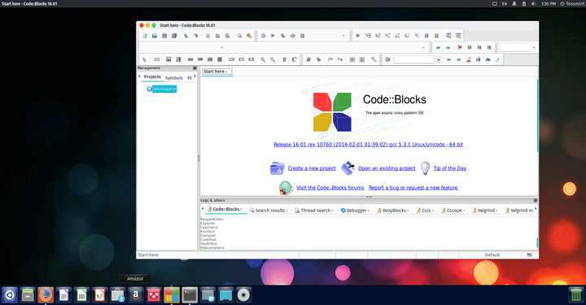
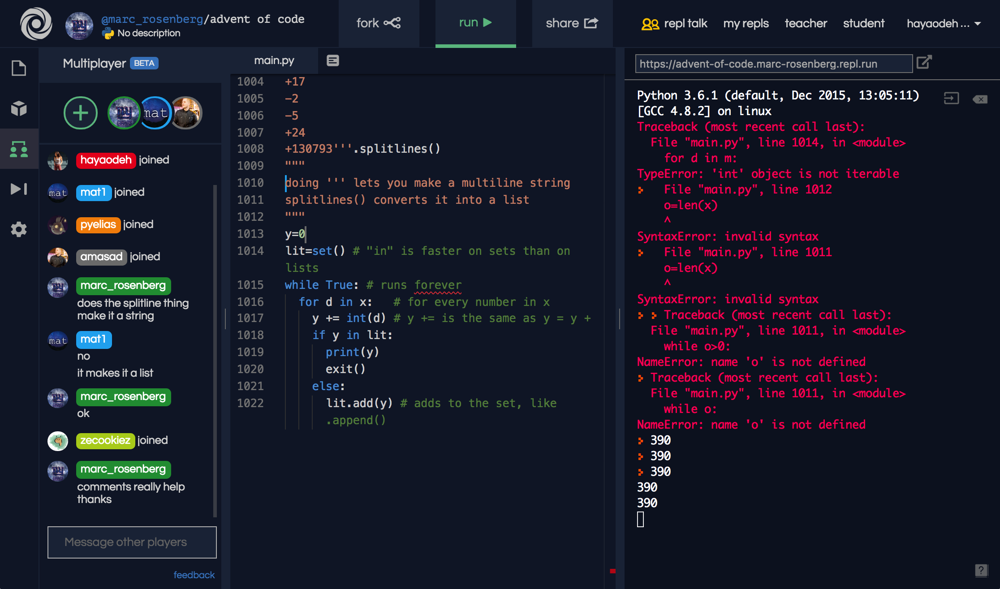

# 1 - Configurando o Ambiente

Seção 1 - Opções e Configurando o Ambiente

Primeiramente, precisamos configurar o ambiente de programação para conseguirmos começar a programar.

Mas, o que seria um ambiente de programação? No caso, iremos te dar opções de IDE's.

- IDE(Ambiente de Desenvolvimento Integrado) é um programa que reúne ferramentas para ajudar o desenvolvedor.

Existe várias IDE's para C++ e iremos te dar algumas opções:

- <a href="https://sourceforge.net/projects/falconcpp" target="_blank" rel="noreferrer">Falcon C++</a>

- <a href="https://www.codeblocks.org/downloads" target="_blank" rel="noreferrer">CodeBlocks</a>

- <a href="https://repl.it" target="_blank" rel="noreferrer">Repl.it</a>

Sinta-se livre para escolher a IDE se sua preferência

- Escolha a que deseja utilizar, e siga os passos da seção que corresponde a IDE.
