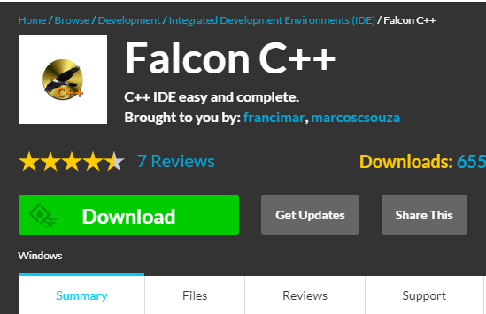
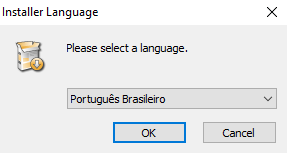
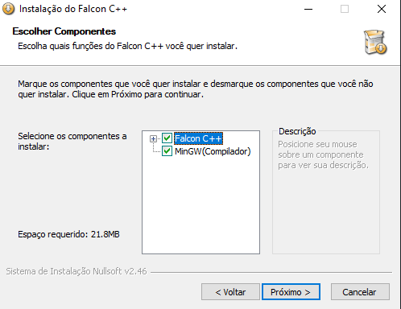
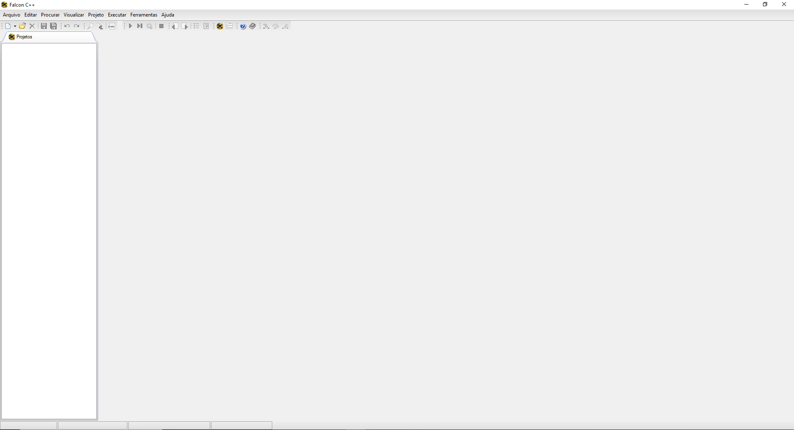
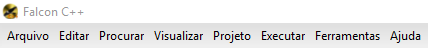

# 1.1 - Instalando o Falcon C++

::: warning

- Neste curso, vamos ensinar apenas a instalar e utilizar o Falcon CPP

:::

::: tip

- Primeiramente, <a href="https://sourceforge.net/projects/falconcpp" target="_blank" rel="noreferrer">vamos entrar no site do Falcon C++</a>

- Clique no botão `Download`

- Após baixar, abra o `.exe`

- Selecione a linguagem de sua preferência

- Clique em próxima até chegar nesta tela abaixo, e selecione estas opções:

:::

::: warning

- Iremos comentar um pouco sobre compiladores na próxima seção

:::

::: tip

- Na próxima tela, escolha o local onde deseja instalar o Falcon C++

- Avance e pronto, temos a tela inicial do Falcon C++!

:::

::: tip

- Agora vamos mostrar um pouco sobre como utilizar a IDE sem muitos problemas

- Inicialmente, vamos começar pelo menu superior

- Ao clicar no menu `Arquivo`, temos estas opções:

- Abrindo o `Novo`, temos estas opções:

- Para agora, apenas a opção `Arquivo C++` nos interessa, clique nela para criar um novo arquivo C++

\*Nesta parte abaixo, é onde escrevemos o nosso código

- As outras opções do menu `Arquivo` são sugestivas, como abrir um arquivo, salvar e fechar

- Na aba `Executar`, temos estas opções:

- Para compilar e executar na sequência, utilize o `Compilar e executar`

- Apenas compilar, utilize o `Compilar`

- `Executar` quando você ja possui um arquivo `.exe`,ou seja, ja compilou

* Você também tem todas estas opções em uma barra

- Pronto! Você tem toda a base para começarmos a programar CPP!

:::

::: warning

- IDE's tem muitos atalhos que pode facilitar a sua vida, recomendamos a dar uma olhada na documentação.

:::
