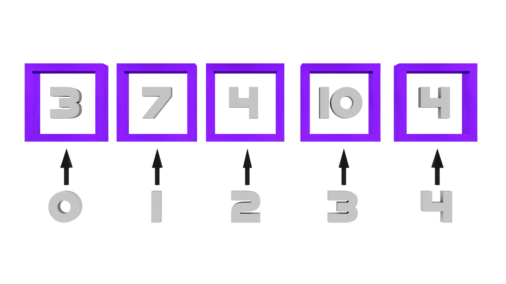

# 7 - Vetores (C Arrays)

Conforme a complexidade de um programa cresce, surge a necessidade de agrupar variáveis e entidades.
Um vetor é uma estrutura (não é a única) que serve para este propósito.

Um vetor (C Array) é um tipo que consiste de uma sequência de elementos que estão lado a lado na memória.
O número de elementos que essa estrutura é capaz de suportar não muda durante a execução do programa.

O tamanho do vetor precisa ser conhecido durante a compilação.

Veremos como criar um array que pode mudar de tamanho durante a execução do programa em outra seção.

# Exemplos

```cpp{0}
#include <iostream>

int main ()
{
    /*|--------------------------------------|
     *|                                      |
     *|           He4rt Developers           |
     *|                                      |
     *|--------------------------------------|
     */

    /**
      * Um array pode conter (quase)qualquer tipo.
      * Por exemplo: int, float, double, std::string
      * Acessar um elemento que está no array leva tempo constante,
      * falaremos mais sobre isso na seção <link pra seção de Big O Nonation>
    */

    /* Declarando um array de 5 posições e que pode conter apenas elementos do tipo int */
    int meu_array[5];

    /**
      * Podemos acessar um elemento do array usando a posição na qual ele se encontra.
      * O primeiro elemento se encontra na posição 0,
      * algo que é padrão na maioria das linguagens de programação.
    */

    /* meu_array contem o número 10 na posição 0 */
    meu_array[0] = 10;

    meu_array[1] = 20;
    meu_array[2] = 30;
    meu_array[3] = 40;
    meu_array[4] = 50;

    /**
      * Nosso array possui 5 posições, começando da posição 0, sendo assim,
      * para acessar a última posição, usamos o número 4.
    */
}
```

Vetores são muito eficientes quando queremos trabalhar com a mesma lógica de variável:


```cpp{0}
#include <iostream>

int main ()
{
    /*|--------------------------------------|
     *|                                      |
     *|           He4rt Developers           |
     *|                                      |
     *|--------------------------------------|
     */

    /**
      * Podemos usar loops para percorrer um array acessando cada elemento
    */

    /* Arrays podem ser inicializados com valores */
    int meu_array[5] = {1, 2, 3, 4, 5};

    /**
      * Percorrendo todas as posições do array e mostrando cada elemento que está na posição
    */

    int posicao = 0;
    while(posicao < 5) 
    {
      std::cout << meu_array[posicao] << std::endl;
      posicao++;
    }
}
```

Vetores iniciam na posição `0`,`NÃO` em `1`

Exemplo de uma vetor => `int vetor[5] = { 3, 7, 4, 10, 4}`



# Exemplo de Aplicação de Loops em vetores

```cpp{0}
#include <iostream>

int main () 
{
    /*|--------------------------------------|
     *|                                      |
     *|           He4rt Developers           |
     *|                                      |
     *|--------------------------------------|
     */

    int idade[5];
    bool adulto[5];
    int i = 0; // i representará a posicao no vetor
    
    while(i < 5) 
    {
        std::cout << "Digite a " << (i + 1) << " idade: \n";
        std::cin >> idade[i];

        if(idade[i] >= 18) 
        {
            adulto[i] = true;
        }
        else 
        {
            adulto[i] = false;
        }
        i++; // Sempre que chegar no final do loop, será interado para conseguirmos dar entrada de dados em outra posição do vetor
    }

    i = 0; // Zerando i

    while(i < 5) 
    {
        if(adulto[i]) // Condicao se adulto[posicao] for verdadeira
        {
            std::cout << idade[i] << " e considerado adulto." << std::endl;
        }
        else 
        {
            std::cout << idade[i] << " nao e considerado adulto." << std::endl;
        }
        i++;
    }
}

// Para verificar se adulto[posicao] for negativa, poderiamos usar if(!adulto[i])
```

# O Loop FOR

Como vimos, para percorrer um vetor precisamos de um loop, para percorrer des de seu início até o seu final.

O `FOR` é muito parecido com o `WHILE`, mas com a vantagem de alguns "recursos" incluídos para facilitar a utilização de loop's em determinadas situações.

FOR:
```cpp{0}
for(int i = 0;i < <tamanho_do_vetor>; i++) {}
```

`int i = 0` é o valor inicializado.

`i < <tamanho_do_vetor>` é a condição para o for continuar.

`i++` é o valor que vai ser iterado ao final do loop, igual utilizamos nos exemplo anterioes com `i++` no final de cada loop.

* Lembrando que poderia ser qualquer outro valor no `i++`, utilizamos como padrão para avançar a próxima posição no vetor

A utilização do `FOR` acaba facilitando percorrer vetores
```cpp{0}
#include <iostream>

int main () 
{
  /*|--------------------------------------|
   *|                                      |
   *|           He4rt Developers           |
   *|                                      |
   *|--------------------------------------|
   */

  double v[5] = { 1.123, 2.43, 1.23, 5.42, 5.4 };

  for(int i = 0; i < 5; i++)
  {
    std::cout << v[i] << std::endl;
  }
}
```

```cpp{0}
#include <iostream>

int main () 
{
  /*|--------------------------------------|
   *|                                      |
   *|           He4rt Developers           |
   *|                                      |
   *|--------------------------------------|
   */
  char v[10];

  for(int i = 0; i < 10; i++)
  {
    std::cin >> v[i];
  }

  for(int i = 0; i < 10; i++) 
  {
    std::cout << v[i] << " ";
  }
}
```