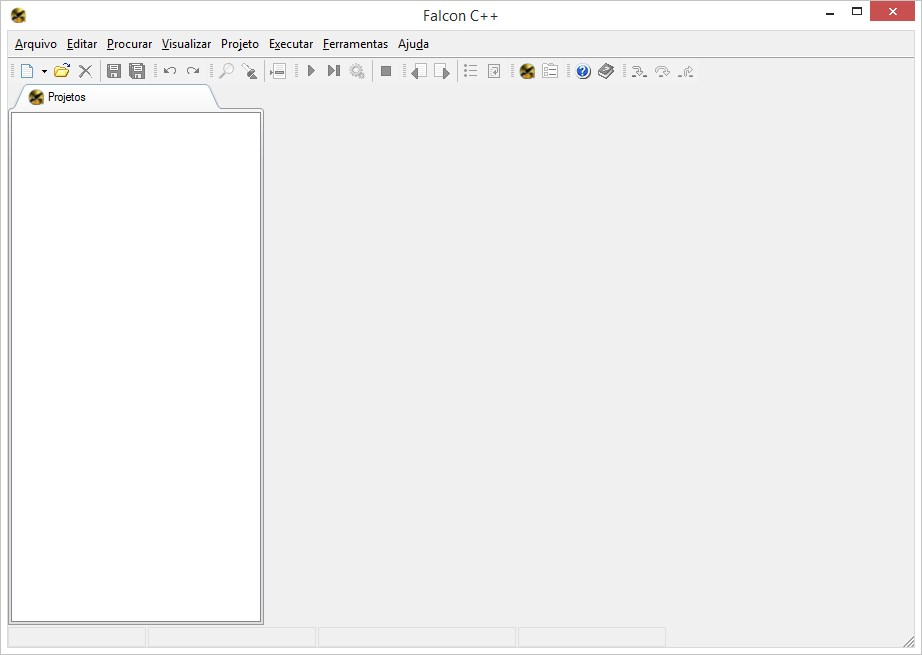

# Configurando o Ambiente

::: tip

Seção 1 - Opções e Configurando o Ambiente

Primeiramente, precisamos configurar o ambiente de programação para conseguirmos começar a programar.

Mas, o que seria um ambiente de programação?No caso, iremos te dar opções de IDE's.

* IDE(Ambiente de Desenvolvimento Integrado) é um programa que reúne ferramentas para ajudar o desenvolvedor.

Existe várias IDE's para C++ e iremos te dar algumas opções:

- <a href="https://sourceforge.net/projects/falconcpp" target="_blank rel=”noreferrer”">Falcon C++</a>

- <a href="www.codeblocks.org/downloads" target="_blank rel=”noreferrer”">CodeBlocks</a>

- <a href="https://repl.it" target="_blank rel=”noreferrer”">Repl.it</a>

Sinta-se livre para escolher a IDE se sua preferência

Como as IDE's possuem muitos atalhos para facilitar o trabalho do desenvolvedor, irei deixar alguns link's que poderá te auxiliar a usar sua IDE

- <a href="https://pt.slideshare.net/mcastrosouza/ide-falcon-c" target="_blank" rel="noreferrer">https://pt.slideshare.net/mcastrosouza/ide-falcon-c</a>

- <a href="https://panda.ime.usp.br/panda/static/data/codeblocks/windows.html" target="_blank" rel="noreferrer">https://panda.ime.usp.br/panda/static/data/codeblocks/windows.html</a>

:::

# O que é C++?

::: tip

C++ (pronunciado como C plus plus) foi desenvolvido por Bjarne Stroustrup no Bell Labs como uma extensão para C, começando em 1979. C++ adiciona muitos recursos à linguagem C, e pode ser considerado um "superconjunto" do C.

:::

